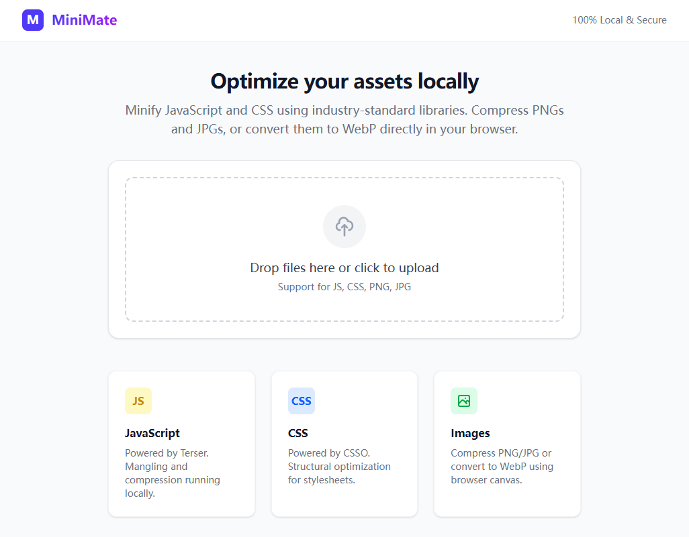

# MiniMate - Local Minifier

A smart tool to minify JavaScript, CSS and Images locally using Terser, CSSO, and Canvas.

## Optimize your assets locally

Minify JavaScript and CSS using industry-standard libraries. Compress PNGs and JPGs, or convert them to WebP directly in your browser.

It is very important and nessary to reduce online assets file size, especially for the [free online web games site](https://www.arcadeh5.com/). Smaller javascript | css | image size mean less bandwith requirement, and play instantly. The player will feel better and get a good experience.

